## Prerequisites

- Unreal Engine 5.3
- Visual Studio Code
- Yarn Spinner for Visual Studio Code
- Demo assets

## Create the Project

- Create a new Third Person game project.
  - Use Blueprint or C++, it doesn't matter!
  - Include the Start Content.
- Hit the play button and use WASD to run around, and spacebar to jump. Press escape when you're done.

## Add Yarn Spinner

- Close the Unreal Editor.
- Open your project's folder in Explorer.
- Create a new folder called "Plugins".
- Clone the Yarn Spinner for Unreal repo into the Plugins folder you just created.
- Open the project again.
  - Unreal Editor will say that the modules YarnSpinner and YarnSpinnerEditor are missing, and ask if you'd like to rebuild them. Choose Yes.
  - Wait for the editor to launch.
  
## Add the Yarn Content

- Open the Content Drawer, and create a new folder. Name it "DemoBlueprints".
- Create another folder next to it, and name it "DemoDialogue".

- Unzip the demo assets into the DemoDialogue folder.
- Select all of the unzipped assets, and drag and drop them into the DemoDialogue folder inside the Unreal Editor.
- Open the File menu, and choose Save All.

## Set Up Interaction

We'll set up the scene so that there's a character you can walk up to and talk to.

### Create the `Interactable` Component

- In the Content Drawer, go to the Demo folder you created earlier.
- Right click inside the folder, and create a new Blueprint Class. 
  - Make it a subclass of Actor Component, and name it `AC_Interactable`.

- Open the newly created blueprint.
- Add a new variable called Yarn Node, of type Name. Make it Instance Editable.

### Add The Interactable Character

- Open the Content Drawer, and navigate to **Characters** / **Mannequins**.
- Drag SKM_Manny into the scene.
  - Place it in front of the Player Start, and rotate it to face the Player Start.
  - Select it, and in the Details pane, set the Anim Class to ABP_Manny.
  - The character will now be playing an idle animation.

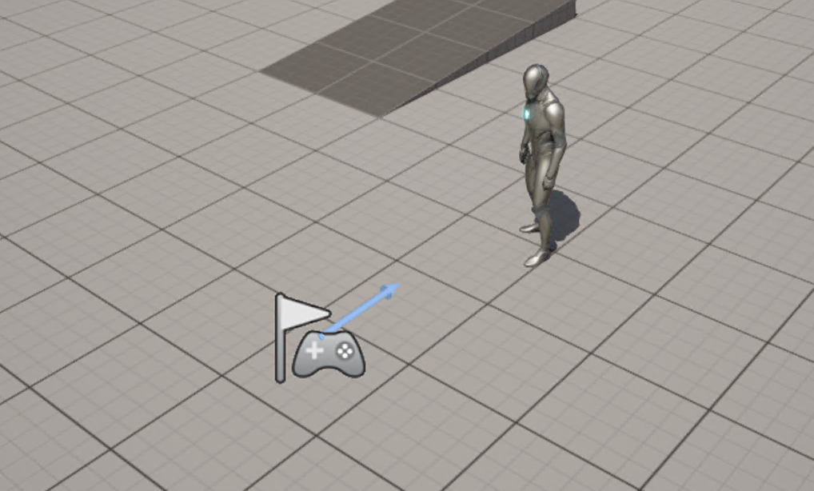

- In the Details pane, click Add, and search for the 'AC_Interactable' component you added earlier.
  - Add it to the actor.
  - Set the Yarn Node to 'Gary'.
- Next, select the character's SkeletalMeshComponent, and add a Capsule Collision.
  - Update the Capsule's Transform:
    - Set the Location to (0, 0, 96).
  - Update the Capsule's Shape:
    - Set the Capsule Half Height to 96.
    - Set the Capsule Radius to 48.


### Create an 'Interact' Input Action

- In the Content Drawer, open **ThirdPerson** / **Input** / **Actions**.
- Right click, and choose Input -> Input Action. 
  - Name the new action `IA_Interact`.
- Go to the **ThirdPerson** / **Input** folder, and open the IMC_Default asset.
- In the Mappings section, click the plus button to add a new mapping.
  - In the drop-down menu that appears, select the IA_Interact asset you just created.
  - Expand the binding, and click the Keyboard button that appears.
  - Press the `E` key, and the action will be bound to the E key on your keyboard.
- Close the window, and save all files.

### Add Interaction to the Player Character

- In the Content Drawer, open **ThirdPerson** / **Blueprints**.
- Open the BP_ThirdPersonCharacter blueprint.
- In the Viewport, find the Capsule Component in the Components tab.
- Click the Add button, and choose Sphere Collision.
- Name the newly added component `InteractionSphere`.
- In the details pane, set up the sphere:
  - Set Transform -> Location to (80, 0, 20).
  - In the Events section, create events for On Component Begin Overlap and On Component End Overlap.
- Add a new variable. Name it `CurrentInteractable`, and set its type to 'AC Interactable'.
- Add another new variable. Name it `DialogueRunner`, and set its type to `DialogueRunner`. Make it Instance Editable.
- In the Event Graph, right click and search for IA_Interact. Add it to the graph.
- Update the Event Graph to find and store the Dialogue Runner in the scene.
  [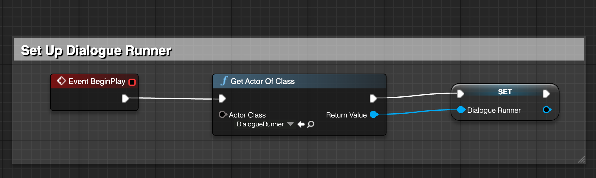](https://downloads.yarnspinner.dev/get/ue-tutorial/blueprint_html/BP_ThirdPersonCharacter_OnBeginPlay.html)
- Update the event graph to set and clear the CurrentInteractable variable when the player approaches an Interactable component:
  [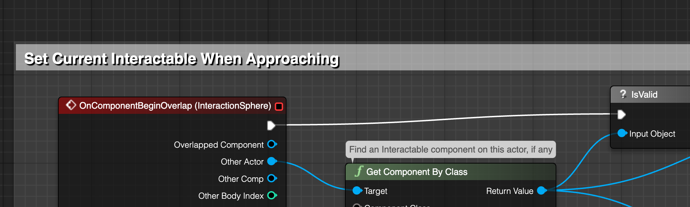](https://downloads.yarnspinner.dev/get/ue-tutorial/blueprint_html/BP_ThirdPersonCharacter_OnComponentBeginOverlap.html)
  [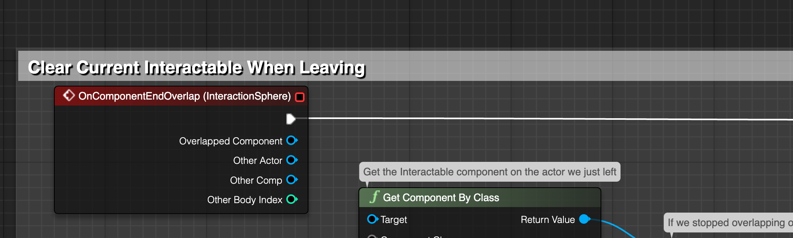](https://downloads.yarnspinner.dev/get/ue-tutorial/blueprint_html/BP_ThirdPersonCharacter_OnComponentEndOverlap.html)

- Next, update the event graph to start the dialogue when the Interact key is pressed.

  [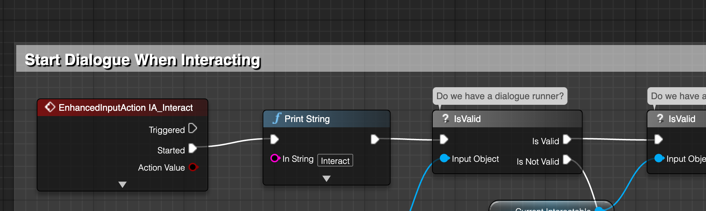](https://downloads.yarnspinner.dev/get/ue-tutorial/blueprint_html/BP_ThirdPersonCharacter_OnInteract.html)

- Finally, compile, save and close the blueprint.

## Create The Dialogue Runner

- In the Content Drawer, open **DemoBlueprints**.
- Right click and create a new Blueprint Class.
- Expand the 'All Classes' dropdown, and search for Dialogue Runner. Select Object -> Actor -> Dialogue Runner.
- Name the new blueprint `BP_GameDialogueRunner`.
- Drag the blueprint into the scene.
- In the Content Drawer, open **DemoDialogue**. Drag the DemoProject Yarn Project into the dialogue runner's Yarn Project field.

We can now quickly test the game to make sure that interaction is working, and that Yarn Spinner can access your dialogue.

- Click the Play button, and walk up to the interactable character. 
- Press the E key to talk to them. No lines will appear, but if you open the Output Log and scroll up, you'll see lines like this:

  ```
  Warning: DialogueRunner received line with ID "line:gary-0". Implement OnRunLine to customise its behaviour.
  ```

  This tells us that the line is sucessfully running, but we're not doing anything with it yet.

## Implement Line Delivery

When Yarn Spinner imports the Yarn Project, it reads all of the lines in that project's Yarn files, and adds them to your game's localisation string tables. It also looks for assets for the each line, like voice-over audio clips. When a Dialogue Runner runs a line, you can access the localised line text, as well as any localised lines.

In the content that you imported earlier, the lines are written in English, and each line has an audio clip containing English voice-over. We'll set up the Dialogue Runner so that when a line is run, the voice-over plays. When the voice-over is finished, the dialogue runner will proceed to the next piece of content.

- Open the BP_GameDialogueRunner blueprint.
- Click Open Full Blueprint Editor.
- Right click the Event Graph and choose Add Event -> Dialogue Runner -> Event On Run Line.
- Add the following nodes to the event:

  [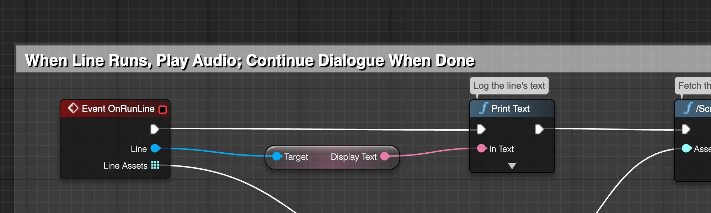](https://downloads.yarnspinner.dev/get/ue-tutorial/blueprint_html/BP_GameDialogueRunner_OnRunLine.html)

- We'll also add an event to handle options. This will start empty, but we'll add to it.

   [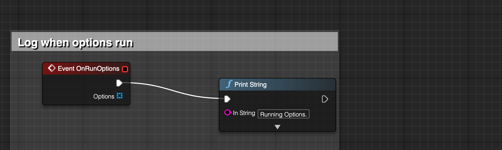](https://downloads.yarnspinner.dev/get/ue-tutorial/blueprint_html/BP_GameDialogueRunner_OnRunOptions_Empty.html)

- Play the game.
  - Walk up to the character, and press the E key. 
  - You'll hear the voice-over for the lines.

## Create The Option Selector

Next, we'll set up option selection. Because choosing an option requires some kind of user input, we'll need to build a way for the user to choose one of the available options.

In this tutorial, we'll create buttons on screen for each option, and let the user click one of them to choose the option.

### Create the Option Button

- In the Content Drawer, go to **DemoBlueprints**.
- Right click and choose User Interface -> Widget Blueprint.
  - Click User Widget.
  - Name the new blueprint `WBP_OptionButton`
  - Double click it to open.
- Go to the Graph view.
- Add a new variable.
  - Set its name to Option, and set its type to Option.
  - Turn on Instance Editable.
  - Turn on Expose on Spawn.
- Go to the Designer view.
- Drag a new Button into the Canvas.
- Drag a new Text Block into the Button.
  - Name the Text Block 'Label'.
  - In the Details panel, turn on Is Variable for the Text Block.
  - Find the Content -> Text field, and open the Bind dropdown.
    - Choose Option -> Line -> Display Text.
- Select the Button. 
- In the Details panel, find the On Clicked event, and click the plus button.
- Add a new Event Dispatcher.
  - Name it On Option Selected.
  - Add a new Input to the event dispatcher.
    - Set its name to Option, and its type to Option.
- Drag the On Option Selected event dispatcher into the Event Graph, and choose 'Call' from the popup that appears.
- Connect the On Clicked event for the button to the On Option Selected call:
  [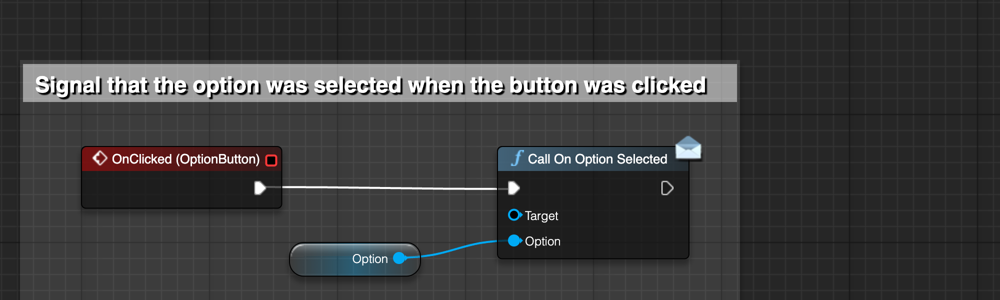](https://downloads.yarnspinner.dev/get/ue-tutorial/blueprint_html/WBP_OptionButton_OnClicked.html)

### Create the Option Selector

- In the Content Drawer, go to **DemoBlueprints**.
- Right click and choose User Interface -> Widget Blueprint.
  - Click User Widget.
  - Name the new blueprint `WBP_OptionSelector`
  - Double click it to open.
- Go to the Designer view.
- Drag a Scroll Box into the canvas.
  - In the Details panel, turn on Is Variable.
  - Rename the variable to 'ScrollBox'.
- Go to the Graph view.
- Add a new variable.
  - Call it PlayerController, and set its type to PlayerController.

Next, we'll create the event that runs when an option has been selected.

- Right click the Event Graph, and create a new Custom Event called `OptionSelected`.
  - Add an Input to the new event named Options, with the type Option.
  - Set up the event:
      [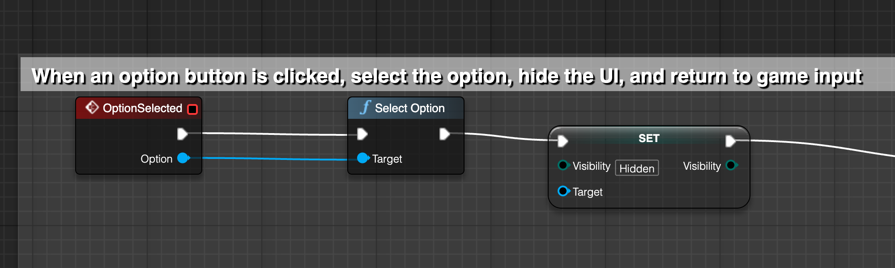](https://downloads.yarnspinner.dev/get/ue-tutorial/blueprint_html/WBP_OptionSelector_OptionSelected.html)

**Compile the blueprint before continuing!**
  - If you don't, you won't be able to connect the buttons you're about to create to the OptionSelected event.

- Right click the Event Graph, and create a new Custom Event called `ClearButtons`.
  - Set up the event:
      [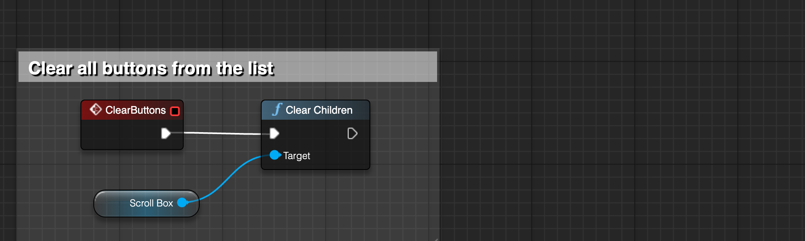](https://downloads.yarnspinner.dev/get/ue-tutorial/blueprint_html/WBP_OptionSelector_ClearButtons.html)
    

- Right click the Event Graph, and create a new Custom Event called CreateOptionButtons.
  - Add an Input to the new event named Options, with the type Array of Option.
  - Set up the event:
      [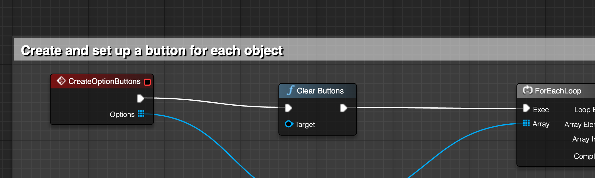](https://downloads.yarnspinner.dev/get/ue-tutorial/blueprint_html/WBP_OptionSelector_CreateOptionButtons.html)

- Right click the Event Graph, and create a new Custom Event called `ShowOptions`.
  - Add an Input to the new event named Options, with the type Array of Option.
  - Add an Input to the new event named PlayerController, with the type PlayerController.
  - Set up the event:
      [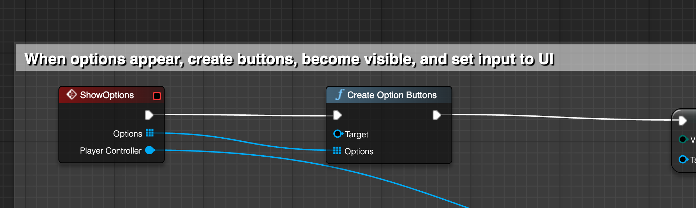](https://downloads.yarnspinner.dev/get/ue-tutorial/blueprint_html/WBP_OptionSelector_ShowOptions.html)

- Finally, right click the Event Graph, and add a Construct event (if one is not already present).
  - Set up the event:
      [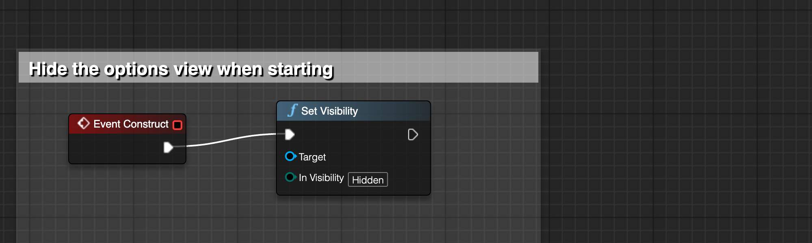](https://downloads.yarnspinner.dev/get/ue-tutorial/blueprint_html/WBP_OptionSelector_Construct.html)
      
- Compile, save and close the blueprint.

## Use the Option Selector in the Dialogue Runner

- Open the BP_GameDialogueRunner blueprint.
- Add a new variable. 
  - Name it `OptionSelector`, and make its type `WBP_OptionSelector`.
- Right click the Event Graph, and add a `BeginPlay` event, if one isn't already present.
  - Set up the event:
      [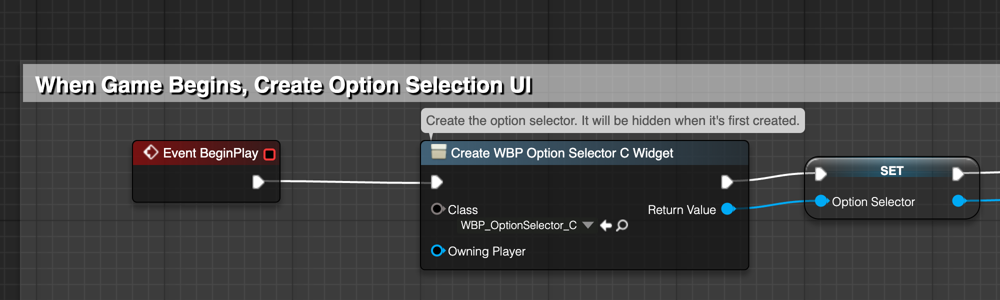](https://downloads.yarnspinner.dev/get/ue-tutorial/blueprint_html/BP_GameDialogueRunner_BeginPlay.html)
    
- Delete the On Run Options event you created earlier, and replace it with a new one.
  - Set up the event:
      [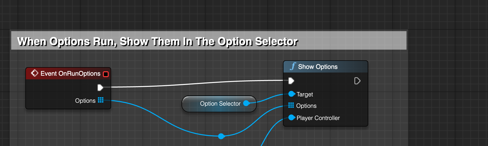](https://downloads.yarnspinner.dev/get/ue-tutorial/blueprint_html/BP_GameDialogueRunner_OnRunOptions_Complete.html)
    

- Compile, save and close the blueprint.

- Play the game.
  - Walk up to the character, and press the E key to talk to them.
  - When the conversation reaches the options, buttons will appear.
  - Click on one of them to advance the conversation.

